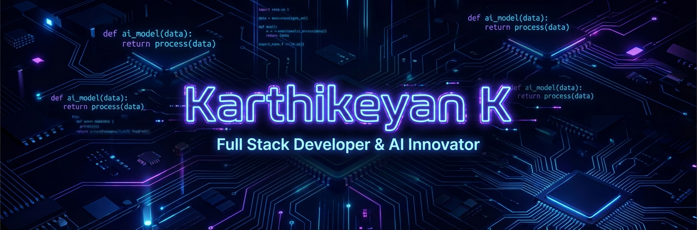
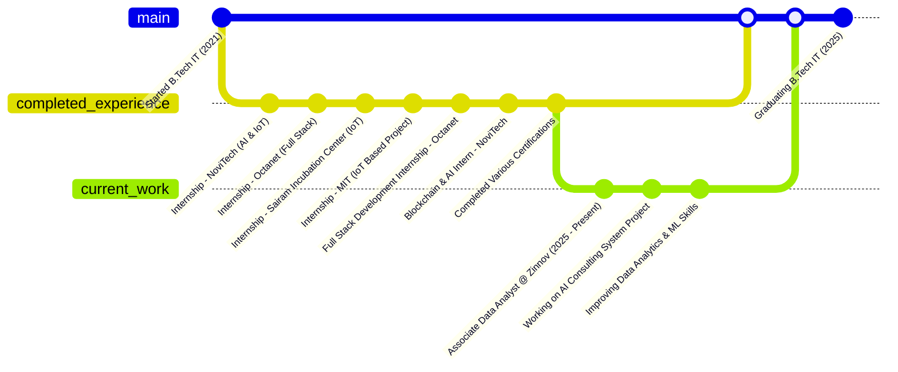

<!-- ========================== -->
<!--        HERO BANNER         -->
<!-- ========================== -->

<div align="center">
  
</div>

<!-- ========================== -->
<!--   ANIMATED TYPING HEADER   -->
<!-- ========================== -->

<h1 align="center">
  
</h1>

<!-- ========================== -->
<!--          BADGES            -->
<!-- ========================== -->

<div align="center">
  
  <!-- Socials -->
  <a href="https://www.linkedin.com/in/karthikeyan2604/">
    
  </a>
  <a href="https://karthikeyank-site.vercel.app/">
    
  </a>
  <a href="mailto:kartji005@gmail.com">
    
  </a>
  <a href="https://github.com/Karthikeyan260">
    
  </a>
  <a href="https://linktr.ee/karthikeyan26">
    
  </a>
  <a href="https://www.credly.com/badges/5621fdd1-0665-4d88-9c5b-4c3adf7efdda/public_url">
    
  </a>

  <br /><br />

  <!-- Roles -->
  
  
  
  

</div>

---

<!-- ========================== -->
<!--        ABOUT SECTION       -->
<!-- ========================== -->

## 🧠 About Me


I'm a passionate **Full Stack Developer** and **Associate Data Analyst** at **Zinnov**, specializing in **AI-driven applications**, **Data Analytics**, and **IoT Systems**. Currently completing my B.Tech in Information Technology at **DMI College of Engineering** (Class of 2025).

**🎯 My Mission:** To bridge the gap between complex data and user-friendly applications by building intelligent, scalable systems using modern web technologies and Artificial Intelligence.

### 🚀 What I'm Working On
- 🤖 **AI Applications** — Building smart apps using **Gemini 2.0**, **Streamlit**, and **Python**.
- 📊 **Data Analytics** — Transforming raw data into actionable insights for business intelligence.
- 🌐 **Full Stack Web** — Creating dynamic, responsive web applications with **React**, **TypeScript**, and **Node.js**.
- 🔗 **Blockchain & IoT** — Exploring decentralized systems and smart device integration.

---

<!-- ========================== -->
<!--      EXPERIENCE GRAPH      -->
<!-- ========================== -->

## 💼 Experience Journey



---

<!-- ========================== -->
<!--     FULL TECH STACK        -->
<!-- ========================== -->

## 🛠️ Tech Stack Arsenal

<div align="center">
  <table>
    <tr>
      <td align="center" width="120"><b>Languages</b></td>
      <td align="center" width="120"><b>Frontend</b></td>
      <td align="center" width="120"><b>Backend & AI</b></td>
      <td align="center" width="120"><b>Tools</b></td>
    </tr>
    <tr>
      <td align="center">
        
      </td>
      <td align="center">
        
      </td>
      <td align="center">
        
      </td>
      <td align="center">
        
      </td>
    </tr>
  </table>
</div>

---

<!-- ========================== -->
<!--      QUICK FACTS (CODE)    -->
<!-- ========================== -->

<details>
<summary><b>💻 Developer Profile (Code Mode) - Click to Expand</b></summary>
<br />

```python
class KarthikeyanK:
    def __init__(self):
        self.name = "Karthikeyan K"
        self.role = "Associate Data Analyst @ Zinnov"
        self.education = "B.Tech IT - DMI College of Engineering (2025)"
        
        self.skills = {
            "languages": ["Python", "Java", "JavaScript", "TypeScript"],
            "frontend": ["React", "Redux", "HTML5", "CSS3", "Tailwind"],
            "backend": ["Node.js", "Express", "Firebase"],
            "ai_ml": ["Gemini AI", "Streamlit", "Data Analytics"],
            "tools": ["Git", "VS Code", "Vercel"]
        }
        
        self.certifications = [
            "Claude Certified Architect - Foundations (CCA-F)"
        ]
        
        self.current_focus = [
            "Building AI-powered web applications",
            "Advanced Data Analytics & Visualization",
            "Exploring Agentic AI Workflows"
        ]

    def fun_fact(self):
        return "I debug with console.log() and I'm not ashamed of it! 😄"
```
</details>

---

<!-- ========================== -->
<!--    FEATURED PROJECTS       -->
<!-- ========================== -->

## 📦 Featured Projects

<table>
<tr>
<td width="50%">

<h3 align="center">🤖 AI Consulting System</h3>
<p align="center">AI-powered consulting platform with domain-specific chatbots for Education, Healthcare, and Finance.</p>
<p align="center">
  
  
</p>
<p align="center">
  <a href="https://github.com/Karthikeyan260/AiConsultingSystem">View Code</a> • <a href="https://aiconsultingsystem.netlify.app/">Live Demo</a>
</p>

</td>
<td width="50%">

<h3 align="center">🥗 NutrifyAI</h3>
<p align="center">AI web app that analyzes food images to provide instant nutritional insights and calorie counts.</p>
<p align="center">
  
  
</p>
<p align="center">
  <a href="https://github.com/Karthikeyan260/NutriLens">View Code</a> • <a href="https://nutrifyai.streamlit.app/">Live Demo</a>
</p>

</td>
</tr>
<tr>
<td width="50%">

<h3 align="center">📄 Job App Assistant</h3>
<p align="center">AI tool to optimize resumes, generate cover letters, and analyze job compatibility.</p>
<p align="center">
  
  
</p>
<p align="center">
  <a href="https://github.com/Karthikeyan260/AI-Powered-Job-Application-Assistant">View Code</a> • <a href="https://ai-powered-job-application-assistant.streamlit.app/">Live Demo</a>
</p>

</td>
<td width="50%">

<h3 align="center">🌦️ Weather Dashboard</h3>
<p align="center">Real-time weather application using OpenWeatherMap API with dynamic updates.</p>
<p align="center">
  
  
</p>
<p align="center">
  <a href="https://github.com/Karthikeyan260/Weather-Dashboard">View Code</a> • <a href="https://weather-dashboard-rho-inky.vercel.app/">Live Demo</a>
</p>

</td>
</tr>
</table>

<p align="center">
  <a href="https://github.com/Karthikeyan260?tab=repositories">
    
  </a>
</p>

---

<!-- ========================== -->
<!--     CERTIFICATIONS         -->
<!-- ========================== -->

## 🎓 Certifications

<div align="center">
  <a href="https://www.credly.com/badges/5621fdd1-0665-4d88-9c5b-4c3adf7efdda/public_url">
    
  </a>
</div>

---

<!-- ========================== -->
<!--         TROPHIES           -->
<!-- ========================== -->

## 🏆 GitHub Trophies

<div align="center">
  
</div>

---

<!-- ========================== -->
<!--      GITHUB ANALYTICS      -->
<!-- ========================== -->

## 📊 GitHub Analytics

<div align="center">

  <!-- Activity Graph -->
  
  
  <br /><br />

  <!-- Stats & Streak -->
  
  
  
  <br />
  
  <!-- Top Langs -->
  

</div>

---

<!-- ========================== -->
<!--        STAR HISTORY        -->
<!-- ========================== -->

## ⭐ Star History

<div align="center">
  
</div>

---

<!-- ========================== -->
<!--        GIT ANIMALS         -->
<!-- ========================== -->

## 🐾 My Git Pets

<div align="center">
  
</div>

---

<!-- ========================== -->
<!--          FOOTER            -->
<!-- ========================== -->

<div align="center">
  
  <br />
  <p>© 2024 Karthikeyan K | Built with ❤️ and Code</p>
  
</div>
