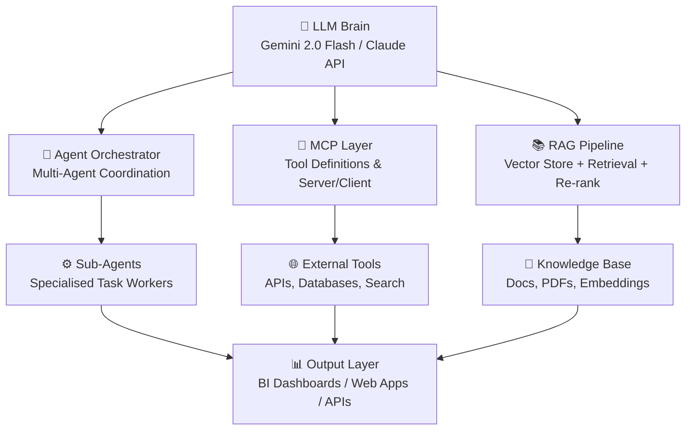
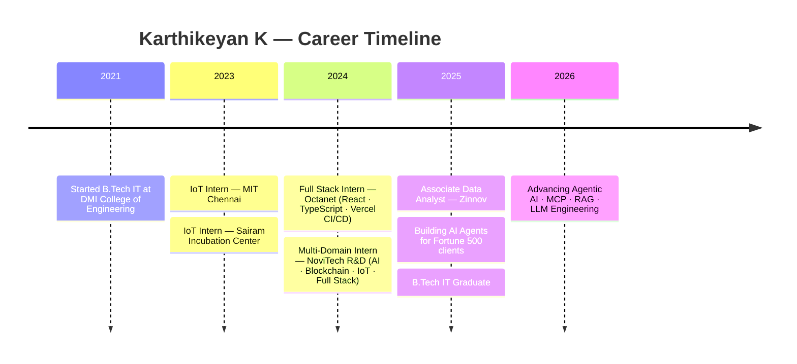

<!-- ============================================================ -->
<!--  SEO META — Indexed by GitHub, Google, Bing crawlers        -->
<!-- ============================================================ -->
<!--
  name:        Karthikeyan K — AI Engineer | Agentic AI Developer | Full Stack
  description: GitHub profile of Karthikeyan K — AI Engineer & Agentic AI
               Developer specialising in LLM orchestration, MCP, RAG pipelines,
               AI Agents, and Full Stack development. Associate Data Analyst at
               Zinnov. Builds production AI systems with Gemini 2.0, Claude API,
               Next.js 15, React, Python, Streamlit, SpaCy & Hugging Face.
               12+ live projects. Claude Certified Architect (CCA-F). Chennai.
  keywords:    Karthikeyan K, Karthikeyan260, AI Engineer India, Agentic AI
               Developer, LLM Engineer, MCP Developer, RAG Engineer,
               AI Agent Developer Chennai, Gemini AI Engineer, Claude API,
               Anthropic Developer, Full Stack AI Developer, Data Analyst
               Zinnov, Next.js TypeScript React Developer, Python Streamlit,
               Hugging Face NLP SpaCy NER, AI Agents 101 AMD, CCA-F Certified,
               DMI College Engineering Chennai, GitHub India Developer,
               NutrifyAI, AI Consulting System, Address NER 92 F1 score
  author:      Karthikeyan K (@Karthikeyan260)
  canonical:   https://karthikeyank-site.vercel.app/
  twitter:     @karthik_keyan04
  robots:      index, follow
-->

<!-- ============================================================ -->
<!--            ANIMATED CAPSULE HEADER — WAVING                  -->
<!-- ============================================================ -->

<div align="center">
  
</div>

<!-- ============================================================ -->
<!--         ANIMATED TYPING — AI ENGINEER FIRST                  -->
<!-- ============================================================ -->

<h1 align="center">
  
</h1>

<!-- ============================================================ -->
<!--                    SOCIAL BADGES                             -->
<!-- ============================================================ -->

<div align="center">

  [](https://www.linkedin.com/in/karthikeyan2604/)
  [](https://karthikeyank-site.vercel.app/)
  [](mailto:kartji005@gmail.com)
  [](https://github.com/Karthikeyan260)
  [](https://www.instagram.com/karthik_keyan04)
  [](https://linktr.ee/karthikeyan26)

  <br />

  [-D97757?style=for-the-badge&logo=anthropic&logoColor=white)](https://www.credly.com/badges/5621fdd1-0665-4d88-9c5b-4c3adf7efdda/public_url)
  [](https://karthikeyank-site.vercel.app/resume.pdf?v=2026-05)

  <br /><br />

  
  
  
  
  
  
  
  

  <br /><br />

  

</div>

---

<!-- ============================================================ -->
<!--                   TABLE OF CONTENTS                          -->
<!-- ============================================================ -->

<details open>
<summary><b>📋 Table of Contents</b></summary>

- [Who I Am — AI Engineer Focus](#-who-i-am)
- [Agentic AI Stack](#-agentic-ai-stack)
- [Quick Stats](#-quick-stats)
- [Experience](#-experience)
- [Education](#-education)
- [Full Tech Stack](#️-full-tech-stack)
- [Skill Proficiency](#-skill-proficiency)
- [Featured AI Projects](#-featured-ai-projects)
- [Other Projects](#-other-projects)
- [Certifications](#-certifications)
- [Achievements](#-achievements)
- [GitHub Trophies](#-github-trophies)
- [GitHub Analytics](#-github-analytics)
- [Contribution Snake](#-contribution-snake)
- [Developer Profile](#-developer-profile)

</details>

---

<!-- ============================================================ -->
<!--              WHO I AM — AI ENGINEER FIRST                    -->
<!-- ============================================================ -->

## 🤖 Who I Am


I'm an **AI Engineer** and **Agentic AI Developer** — currently working as an **Associate Data Analyst at [Zinnov](https://www.zinnov.com/)**, a global management consulting firm where I build **AI agents that automate research workflows** and accelerate insight generation for Fortune 500 clients.

I hold a **B.Tech in Information Technology** from DMI College of Engineering, Chennai (2021–2025) and hold the **Claude Certified Architect — Foundations (CCA-F)** credential from Anthropic, along with multiple certifications in AI Agents, MCP, RAG, and Prompting.

> **Focus:** Building production-grade agentic AI systems — LLM orchestration, multi-agent pipelines, MCP integrations, RAG architectures, NLP models, and full-stack AI-powered web applications.

### 🎯 Core AI Engineering Focus

| Domain | What I Build |
|:---|:---|
| 🧠 **Agentic AI & LLM Orchestration** | Multi-agent pipelines, tool-use agents, LLM routing, prompt chains |
| 🔌 **MCP (Model Context Protocol)** | MCP server/client integrations, Anthropic Claude API, tool definitions |
| 📚 **RAG Pipelines** | Retrieval-augmented generation, vector stores, chunking, re-ranking |
| 🤖 **Gemini 2.0 Flash / Claude API** | Production apps, vision models, streaming, function calling |
| 🏷️ **NLP & NER** | Named Entity Recognition, SpaCy, Hugging Face Transformers, 92% F1 |
| 📊 **AI Data Pipelines** | Automated research, BI dashboards, data agents for Fortune 500 |
| 🌐 **Full Stack AI Apps** | Next.js 15 + Gemini/Claude backend, Streamlit data apps, Firebase |

<br clear="right"/>

---

<!-- ============================================================ -->
<!--              AGENTIC AI STACK — HERO SECTION                 -->
<!-- ============================================================ -->

## 🧬 Agentic AI Stack

<div align="center">


</div>



<div align="center">

| Layer | Technologies |
|:---:|:---|
| **LLMs** | Gemini 2.0 Flash · Claude API (Anthropic) · OpenAI-compatible APIs |
| **Agentic Frameworks** | MCP (Model Context Protocol) · RAG · LLM Function Calling · Tool Use |
| **NLP / ML** | SpaCy · Hugging Face Transformers · scikit-learn · NER · Embeddings |
| **Orchestration** | Multi-agent pipelines · Prompt chaining · Task routing · Memory layers |
| **AI Apps** | Streamlit · Next.js 15 + AI backend · Firebase · FastAPI |
| **Certifications** | CCA-F · Claude API · Claude Code · Agent Skills · MCP · RAG · AMD AI |

</div>

---

<!-- ============================================================ -->
<!--                      QUICK STATS                             -->
<!-- ============================================================ -->

## ⚡ Quick Stats

<div align="center">


| 🚀 Projects | 🎓 AI Certs | 🏢 Internships | 📦 Repos | 🤖 AI Apps in Prod |
|:---:|:---:|:---:|:---:|:---:|
| **12+** | **10+** | **4+** | **32** | **3+** |

</div>

---

<!-- ============================================================ -->
<!--                       EXPERIENCE                             -->
<!-- ============================================================ -->

## 💼 Experience



### 📋 Role Details

| Period | Role | Company | Key Work |
|:---|:---|:---|:---|
| **Jun 2025–Present** | **Associate Data Analyst** | **Zinnov** | AI agents automating research workflows · BI dashboards · LLM pipelines · Fortune 500 clients |
| Jun–Jul 2024 | Full Stack Developer Intern | Octanet | React + TypeScript + Redux · CI/CD on Vercel · sub-second load · production To-Do app |
| May–Jul 2024 | Multi-Domain Tech Intern | NoviTech R&D | 4 parallel tracks: AI, Blockchain, IoT, Full Stack |
| Academic | IoT Intern | Sairam Incubation Center | IoT systems · hardware-software integration |
| Academic | IoT Intern | MIT Chennai (Madras Inst. of Technology) | IoT development · systems integration |

> 💡 **At Zinnov** — a global management consulting firm (NY, Santa Clara, Houston, Seattle, Bangalore, Gurgaon, Pune) serving Fortune 500s with AI/ML intelligence, GCC strategy, digital transformation, and offshore advisory.

---

<!-- ============================================================ -->
<!--                       EDUCATION                              -->
<!-- ============================================================ -->

## 🎓 Education

| Period | Qualification | Institution | Score |
|:---|:---|:---|:---:|
| 2021–2025 | **B.Tech — Information Technology** | DMI College of Engineering, Chennai | 92% |
| 2021 | HSC — Higher Secondary | Singaram Pillai Higher Secondary School | 78% |
| 2019 | SSLC — Secondary | Singaram Pillai Higher Secondary School | 85% |

> 🏆 Completed **4 industry internships** (AI · Full Stack · IoT · Blockchain) while pursuing the degree.

---

<!-- ============================================================ -->
<!--                     FULL TECH STACK                          -->
<!-- ============================================================ -->

## 🛠️ Full Tech Stack

<div align="center">

| Category | Technologies |
|:---:|:---:|
| **Languages** | [](https://python.org) [](https://typescriptlang.org) [](https://developer.mozilla.org/docs/Web/JavaScript) [](https://java.com) |
| **AI / LLMs** |      |
| **ML / NLP** | [](https://huggingface.co/karthik2604)   [](https://tensorflow.org) [](https://pytorch.org)   |
| **AI App Frameworks** |     |
| **Frontend** | [](https://nextjs.org) [](https://reactjs.org) [](https://redux.js.org) [](https://tailwindcss.com)   |
| **Backend & DB** | [](https://nodejs.org) [](https://firebase.google.com) [](https://mysql.com)   |
| **DevOps & Tools** | [](https://git-scm.com) [](https://github.com/Karthikeyan260) [](https://vercel.com) [](https://docker.com) [](https://postman.com) [](https://code.visualstudio.com) |

</div>

---

<!-- ============================================================ -->
<!--                   SKILL PROFICIENCY                          -->
<!-- ============================================================ -->

## 📈 Skill Proficiency

<div align="center">

| Skill | Level | Bar |
|:---|:---:|:---|
| Python | 90% | `████████████████████░░` |
| JavaScript / TypeScript | 85% | `█████████████████████░` — `███████████████████░░░` |
| HTML & CSS | 80% | `████████████████████░░` |
| NumPy & Pandas | 80% | `████████████████████░░` |
| React / Next.js | 75–70% | `███████████████████░░░` |
| Machine Learning | 75% | `███████████████████░░░` |
| Streamlit | 78% | `███████████████████░░░` |
| NLP / SpaCy | 72% | `██████████████████░░░░` |
| Generative AI / LLMs | 70% | `█████████████████░░░░░` |
| Blockchain | 70% | `█████████████████░░░░░` |
| FastAPI / Flask | 70% | `█████████████████░░░░░` |
| Node.js / Express | 65% | `████████████████░░░░░░` |
| IoT | 65% | `████████████████░░░░░░` |
| Hugging Face | 68% | `████████████████░░░░░░` |
| MongoDB | 65% | `████████████████░░░░░░` |

</div>

---

<!-- ============================================================ -->
<!--                  FEATURED AI PROJECTS                        -->
<!-- ============================================================ -->

## 📦 Featured AI Projects

<div align="center">
  
</div>

<table>
<tr>
<td width="50%" valign="top">

### 🤖 AI Consulting System
Multi-domain AI consulting platform with **domain-specific chatbots** for Education, Healthcare, Finance & Retail. Powered by **Gemini 2.0 Flash** with function calling, **Clerk Auth**, real-time **Firebase** persistence, and smooth **Framer Motion** UI.


**AI Patterns:** LLM routing · domain-aware prompts · function calling

[View Code](https://github.com/Karthikeyan260/AiConsultingSystem) · [Live Demo](https://aiconsultingsystem.netlify.app/)

</td>
<td width="50%" valign="top">

### 📄 AI Job Application Assistant
End-to-end **agentic job-search tool** — resume optimisation, personalised cover letter generation, **ATS compatibility scoring**, skill gap analysis, and Plotly visualisations. Orchestrates multiple Gemini calls as a lightweight agent pipeline.


**AI Patterns:** Multi-step LLM pipeline · document parsing · scoring agent

[View Code](https://github.com/Karthikeyan260/AI-Powered-Job-Application-Assistant) · [Live Demo](https://ai-powered-job-application-assistant.streamlit.app/)

</td>
</tr>
<tr>
<td width="50%" valign="top">

### 🥗 NutrifyAI — Vision AI App
**Gemini Vision API** food image → instant nutritional breakdown & calorie counts. Demonstrates multimodal LLM integration — image + text prompting pipeline in a clean Streamlit UI.


**AI Patterns:** Multimodal LLM · vision + text fusion · structured extraction

[View Code](https://github.com/Karthikeyan260/NutriLens) · [Live Demo](https://nutrifyai.streamlit.app/)

</td>
<td width="50%" valign="top">

### 🏷️ Address NER — NLP Model (92% F1)
**Production NLP model** extracting structured address components (house no., street, city, postcode, country) from unstructured text using **SpaCy custom NER**. **92% F1 score** — deployed on **Hugging Face Spaces**.


**AI Patterns:** Custom NER · entity extraction · transformer fine-tuning

[View Code](https://github.com/Karthikeyan260/Address_NER) · [Live Demo](https://huggingface.co/spaces/karthik2604/Address_ner)

</td>
</tr>
</table>

---

## 🎮 Other Projects

<div align="center">

| Project | Stack | Live |
|:---|:---|:---:|
| ♟️ **Chess Game** — Minimax AI opponent, full rules, move highlighting | JS · HTML5 · CSS3 | [Demo](https://chess-game-sandy-seven.vercel.app/) |
| 🌦️ **Weather Dashboard** — OpenWeatherMap, 5-day forecast, geolocation | JS · HTML5 · CSS3 | [Demo](https://weather-dashboard-rho-inky.vercel.app/) |
| ✅ **Todo App** — React + Redux + TypeScript, CI/CD on Vercel (Octanet) | React · TS · Redux | [Demo](https://todo-karthikeyan.vercel.app/) |
| 🎙️ **Text to Speech** — Web Speech API, multi-voice, waveform | JS · HTML5 | [Demo](https://text-to-speech-webpage.vercel.app) |
| 🐍 **Snake Game** — Canvas, increasing difficulty, high-score board | JS · Canvas | [Demo](https://snake-game-tawny-tau.vercel.app/) |
| 🃏 **Memory Card Game** — Flip animations, timer, difficulty levels | JS · CSS Animations | [Demo](https://memory-game-seven-snowy.vercel.app/) |
| ⭕ **Tic Tac Toe** — Win/draw detection, animated winning line | JS · HTML5 | [Demo](https://tic-tac-toe-livid-nu.vercel.app/) |
| 🎬 **Netflix Clone** — Pixel-perfect UI, CSS Grid/Flexbox | HTML5 · CSS3 · JS | [Demo](https://netflix-clone-olive-five-55.vercel.app/) |

</div>

<div align="center">
  <a href="https://github.com/Karthikeyan260?tab=repositories">
    
  </a>
</div>

---

<!-- ============================================================ -->
<!--                    CERTIFICATIONS                            -->
<!-- ============================================================ -->

## 🎓 Certifications

<div align="center">
  
</div>

<div align="center">

**🔶 Anthropic — AI Architecture & Engineering**

| Certification | Date | Verify |
|:---|:---:|:---:|
| **Claude Certified Architect — Foundations (CCA-F)** | 2025 | [Credly Badge](https://www.credly.com/badges/5621fdd1-0665-4d88-9c5b-4c3adf7efdda/public_url) |
| Building with the Claude API | May 2026 | Anthropic |
| Claude Code in Action | May 2026 | Anthropic |
| Introduction to Agent Skills | May 2026 | Anthropic |
| Introduction to Model Context Protocol (MCP) | May 2026 | Anthropic |

**🔴 AMD AI Academy — Agentic AI Specialisation**

| Certification | Date |
|:---|:---:|
| AI Agents 101: Building AI Agents with MCP | Jul 2026 |
| AI on AMD | Jul 2026 |
| Introduction to AI Agents | Jul 2026 |
| Introduction to Prompting | Jul 2026 |
| Introduction to RAG | In Progress |

**🔵 Other Platforms**

| Certification | Issuer |
|:---|:---:|
| Introduction to Generative AI | Google Cloud |
| Responsible AI | Google Cloud |
| Cybersecurity Fundamentals | IBM SkillsBuild |
| Kali Linux Basics | IBM SkillsBuild |
| MongoDB for Students | MongoDB University |
| Hugging Face Transformers Workshop | Amrita University |
| 3hr AI & Data Analytics Bootcamp | NoviTech R&D |

</div>

---

<!-- ============================================================ -->
<!--                      ACHIEVEMENTS                            -->
<!-- ============================================================ -->

## 🏅 Achievements

| | Achievement | Details |
|:---:|:---|:---|
| 🛢️ | **SUSTAIN-A-THON 2024** | National-level hackathon by Indian Oil Corporation — energy & sustainability solutions |
| 🎯 | **Whimzial 3.0** | National-level technical symposium — competed across India |
| 📄 | **International Conference Paper** | Deep learning for automated skin disease detection & diagnosis |
| 🤝 | **NSS 'A' Certificate** | 2019–2021 — community service and social responsibility |
| 🐙 | **GitHub Achievements** | Quickdraw · Pair Extraordinaire · YOLO · Pull Shark |
| 👨‍💻 | **GitHub Highlights** | Developer Program Member · Pro |

---

<!-- ============================================================ -->
<!--                     GITHUB TROPHIES                          -->
<!-- ============================================================ -->

## 🏆 GitHub Trophies

<div align="center">
  
</div>

---

<!-- ============================================================ -->
<!--                     GITHUB ANALYTICS                         -->
<!-- ============================================================ -->

## 📊 GitHub Analytics

<div align="center">

  

  <br /><br />

  
  

  <br /><br />

  

</div>

---

<!-- ============================================================ -->
<!--                    CONTRIBUTION SNAKE                        -->
<!-- ============================================================ -->

## 🐍 Contribution Snake

<div align="center">
  <picture>
    <source media="(prefers-color-scheme: dark)" srcset="https://raw.githubusercontent.com/Karthikeyan260/Karthikeyan260/output/github-contribution-grid-snake-dark.svg" />
    <source media="(prefers-color-scheme: light)" srcset="https://raw.githubusercontent.com/Karthikeyan260/Karthikeyan260/output/github-contribution-grid-snake.svg" />
    
  </picture>
</div>

> **Setup:** Add `.github/workflows/snake.yml` using [Platane/snk](https://github.com/Platane/snk) to auto-generate on push.

---

## ⭐ Star History

<div align="center">
  
</div>

---

## 🐾 Git Pets

<div align="center">
  
</div>

---

<!-- ============================================================ -->
<!--               DEVELOPER PROFILE — AI ENGINEER                -->
<!-- ============================================================ -->

## 💻 Developer Profile

<details>
<summary><b>🐍 Click to expand — AI Engineer Python class</b></summary>
<br />

```python
class KarthikeyanK:
    """
    AI Engineer | Agentic AI Developer | Full Stack Developer
    Associate Data Analyst @ Zinnov — Fortune 500 AI Automation
    B.Tech IT — DMI College of Engineering, Chennai (2021–2025)
    Claude Certified Architect — Foundations (CCA-F) | Anthropic
    """

    def __init__(self):
        self.name         = "Karthikeyan K"
        self.handle       = "Karthikeyan260"
        self.title        = "AI Engineer | Agentic AI Developer | Full Stack Dev"
        self.role         = "Associate Data Analyst @ Zinnov"
        self.location     = "Chennai, Tamil Nadu, India"
        self.phone        = "+91 93457 66900"
        self.email        = "kartji005@gmail.com"
        self.portfolio    = "https://karthikeyank-site.vercel.app/"
        self.linkedin     = "https://linkedin.com/in/karthikeyan2604/"
        self.github       = "https://github.com/Karthikeyan260"
        self.hf_profile   = "https://huggingface.co/karthik2604"

        # ── AGENTIC AI STACK ─────────────────────────────────────
        self.agentic_ai = {
            "llms":           ["Gemini 2.0 Flash", "Claude API (Anthropic)"],
            "protocols":      ["MCP (Model Context Protocol)", "Function Calling",
                               "Tool Use", "Streaming"],
            "patterns":       ["RAG", "Multi-Agent Pipelines", "Prompt Chaining",
                               "Task Routing", "Memory Layers", "LLM Orchestration"],
            "frameworks":     ["Streamlit", "FastAPI", "Next.js 15 AI Backend"],
            "certifications": [
                "Claude Certified Architect — Foundations (CCA-F)",
                "Building with the Claude API",
                "Claude Code in Action",
                "Introduction to Agent Skills",
                "Introduction to Model Context Protocol (MCP)",
                "AI Agents 101: Building AI Agents with MCP — AMD AI Academy",
                "Introduction to RAG — AMD AI Academy",
                "Introduction to AI Agents — AMD AI Academy",
                "Introduction to Prompting — AMD AI Academy",
            ],
        }

        # ── ML / NLP ─────────────────────────────────────────────
        self.ml_nlp = {
            "libraries":  ["SpaCy", "Hugging Face Transformers", "scikit-learn",
                           "TensorFlow", "PyTorch", "NumPy", "Pandas"],
            "tasks":      ["NER (92% F1)", "Text Classification", "Embeddings",
                           "Named Entity Recognition", "Document Parsing"],
            "deployed":   ["Hugging Face Spaces — Address NER"],
        }

        # ── FULL STACK ────────────────────────────────────────────
        self.full_stack = {
            "frontend":  ["Next.js 15", "React", "TypeScript", "Redux",
                          "Tailwind CSS", "Framer Motion", "Radix UI", "HTML5"],
            "backend":   ["Node.js", "Express", "FastAPI", "Flask", "Firebase",
                          "MySQL", "MongoDB", "Clerk Auth"],
            "devops":    ["Git", "GitHub", "Vercel", "Netlify", "Docker", "CI/CD"],
        }

        # ── PROJECTS ─────────────────────────────────────────────
        self.projects = {
            "AI Consulting System (Next.js + Gemini 2.0)":
                "https://aiconsultingsystem.netlify.app/",
            "AI Job Application Assistant (Agentic Pipeline)":
                "https://ai-powered-job-application-assistant.streamlit.app/",
            "NutrifyAI (Vision LLM)":
                "https://nutrifyai.streamlit.app/",
            "Address NER — SpaCy (92% F1)":
                "https://huggingface.co/spaces/karthik2604/Address_ner",
            "Chess Game (Minimax AI)":
                "https://chess-game-sandy-seven.vercel.app/",
            "Weather Dashboard":
                "https://weather-dashboard-rho-inky.vercel.app/",
            "Todo App (Octanet Internship)":
                "https://todo-karthikeyan.vercel.app/",
            "Text to Speech":
                "https://text-to-speech-webpage.vercel.app",
            "Snake Game":
                "https://snake-game-tawny-tau.vercel.app/",
            "Memory Card Game":
                "https://memory-game-seven-snowy.vercel.app/",
            "Tic Tac Toe":
                "https://tic-tac-toe-livid-nu.vercel.app/",
            "Netflix Clone":
                "https://netflix-clone-olive-five-55.vercel.app/",
        }

        self.github_stats = {
            "public_repos": 32,
            "stars":        17,
            "achievements": ["Quickdraw", "Pair Extraordinaire",
                             "YOLO", "Pull Shark"],
            "highlights":   ["Developer Program Member", "Pro"],
        }

        self.open_to = [
            "AI Engineer roles",
            "Agentic AI / LLM Engineer positions",
            "ML / NLP Engineer opportunities",
            "Full Stack AI Developer contracts",
            "AI research collaborations",
        ]

    def fun_fact(self) -> str:
        return "I debug with console.log() and I'm not ashamed of it! 😄"

    def current_mission(self) -> str:
        return (
            "Building production-grade agentic AI systems — "
            "LLM orchestration, MCP integrations, RAG pipelines, "
            "and full-stack AI apps that solve real problems."
        )
```

</details>

---

<!-- ============================================================ -->
<!--                   ANIMATED FOOTER                            -->
<!-- ============================================================ -->

<div align="center">

  

  <br /><br />

  

  <p>© 2025 Karthikeyan K &nbsp;·&nbsp; Chennai, India &nbsp;·&nbsp; AI Engineer | Agentic AI Developer | Full Stack</p>

  

</div>
